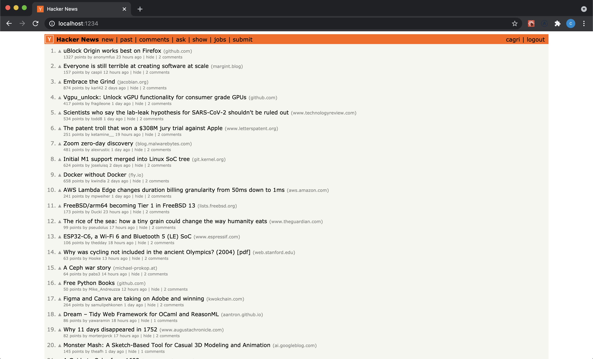

## Hackernews Clone

A full stack hackernews clone build with React, GraphQL, Prisma and Postgres.



## Install

First create `.env` file in the _server_ folder. File should contain,

```
ACCESS_TOKEN_SECRET=
REFRESH_TOKEN_SECRET=
COOKIE_NAME=
DATABASE_URL=
```

You can rename `.env.example` to `.env` for quick start.

If you are going to change _DATABASE_URL_ variable, you should also configure `docker-compose.yml` accordingly.
Check [Connection URLs](https://www.prisma.io/docs/reference/database-reference/connection-urls) to learn more.

To start development, run,

```
docker-compose up
```

in the _root_ folder.

Then, you can go to `localhost:1234` for web client, and, `localhost:4000` for GraphQL playground.

## Mocking

You can mock database with real Hackernews data.
It uses [Hackernews API](https://github.com/HackerNews/API) to fetch recent top posts and couple comments.

`Note: Mocked users have the same password as username.`

Run,

```
docker-compose exec server yarn mock
```

after all services up.

## To-Do

There are lots of [undocumented features](https://github.com/minimaxir/hacker-news-undocumented) in hackernews.
In the future, missing pages and features can be added.
